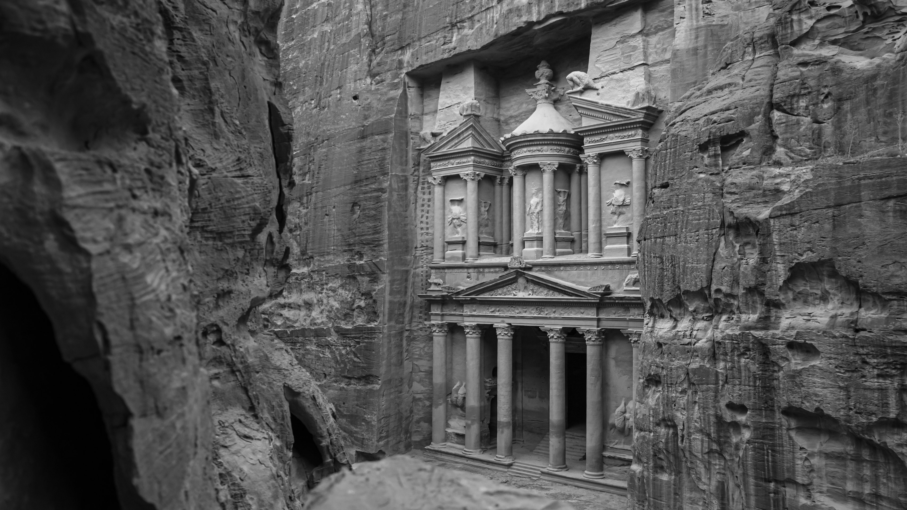

# Image Watermarking with LSB and DCT (图像水印嵌入与提取)

本项目实现了基于 LSB 和 DCT 的图片水印嵌入与提取方法，并支持常见攻击（翻转、裁剪、平移、调对比度）下的鲁棒性测试。

---

## 项目结构

```
project2/
├── LSB.py
├── DCT.py #对LSB的一种改进，可以防御压缩识别不到的问题
```
---

## 实现原理

### LSB 方法（Least Significant Bit）

- 将文本水印转为二进制后，嵌入图像像素值的最低位（LSB）。
- 优点：实现简单、不可见性强；
- 缺点：对翻转、裁剪、压缩等处理非常脆弱。

### DCT 方法（Discrete Cosine Transform）

- 将图像转为频域，对中低频系数进行微调以嵌入水印；
- 优点：较强鲁棒性，可抵抗压缩、滤波、部分裁剪；
- 缺点：实现稍复杂，可能影响图像质量。

---

## 使用方法

### 1. 安装依赖

```bash
pip install opencv-python numpy


## 查看输出
Watermark embedded and saved to data/watermarked.png
Extracted (watermarked): Hidden123
-------------------------some attacks---------------------------
Extracted (flip): ;¤lí¶q"R
Extracted (translate): $!
Extracted (crop): IIN
Extracted (contrast): ù 8ìNH
```

## LSB
### 技术原理
LSB (Least Significant Bit) 水印是一种基于空间域的隐写技术，其核心原理是通过修改图像像素值的最低有效位来嵌入信息。由于最低位对图像视觉效果影响最小，因此可以实现"不可见"的水印嵌入。

### 实现特点
1. **嵌入过程**：
   - 将水印信息转换为二进制序列
   - 按顺序替换图像像素RGB通道中的最低位
   - 每个像素通道可存储1bit信息（每个像素最多3bit）

2. **提取过程**：
   - 读取含水印图像的像素最低位
   - 按嵌入顺序重组二进制数据
   - 将二进制转换为原始信息

3. **技术参数**：
   - 嵌入容量：约可嵌入图像像素总数×3 bits
   - 视觉影响：PSNR通常>40dB（人眼不可察觉）

### 实验结果分析
### 原图片


### 植入水印图片


### 代码输出
```
PS D:\chuagnxinshijian\SM4\project2>  & D:/exe/anaconda/envs/class01/python.exe d:/chuagnxinshijian/SM4/project2/LSB.py
Watermark embedded and saved to data/watermarked.png
Extracted (watermarked): Hidden123
-------------------------some attacks---------------------------
Extracted (flip): ;¤lí¶q"R
Extracted (translate): $!
Extracted (crop): IIN
Extracted (contrast): ù 8ìNH
```

## DCT
### 技术原理
DCT (Discrete Cosine Transform) 水印是一种基于频域的隐写技术，通过修改图像DCT系数的中频分量来嵌入信息。中频区域既保证了水印的不可见性，又提供了较好的鲁棒性。

### 实现特点
1. **嵌入过程**：
   - 将图像分块（通常8×8）并进行DCT变换
   - 选择中频系数（如(3,2)和(2,3)位置）进行修改
   - 通过比较两个系数的相对大小表示1/0比特
   - 采用冗余嵌入提高鲁棒性（默认3次重复）

2. **提取过程**：
   - 相同分块和DCT变换
   - 统计对应位置系数的比较结果
   - 通过多数投票机制确定比特值

3. **技术参数**：
   - 嵌入容量：约 (图像宽度/8)×(图像高度/8)/3 bits
   - 视觉影响：PSNR通常>35dB
   - 修改强度：Δ=5.0（可调参数）

### 实验结果分析
### 原图片


### 植入水印图片


### 压缩后图片


### 代码输出
```
PS D:\chuagnxinshijian\SM4\project2>  & D:/exe/anaconda/envs/class01/python.exe d:/chuagnxinshijian/SM4/project2/DCT.py
 Robust DCT Watermark embedded into data/watermarked_dct.jpg
Extracted watermark: Hidden12
-------------------------some attacks---------------------------
Extracted (flip): .KQ3°
Extracted (translate): ©@-÷ÉIÐ
Extracted (crop): müÚ§³=Äq
Extracted (contrast): O{à:Ú=A
PS D:\chuagnxinshijian\SM4\project2> 
```
## 总结
- 经过演示我们可以发现LCB很脆弱如果压缩图片为jpg会提取不到水印，但是如果改进为DCT会发现即使是压缩也会提取到完整的水印说明DCT的鲁棒性更强

